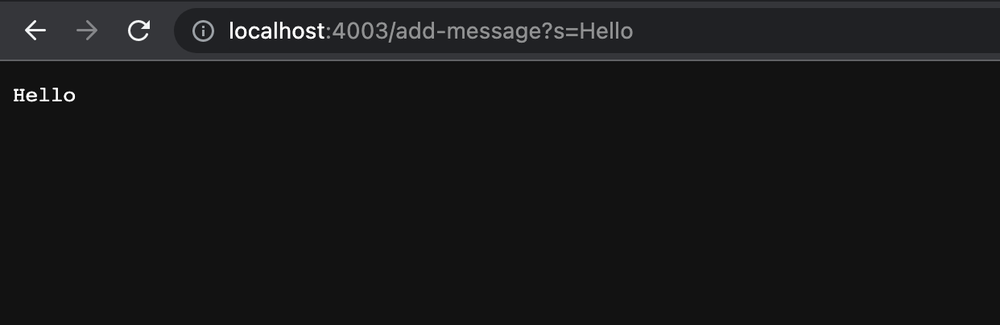
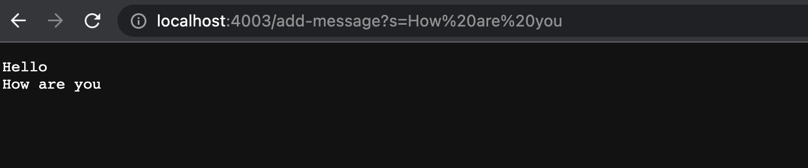
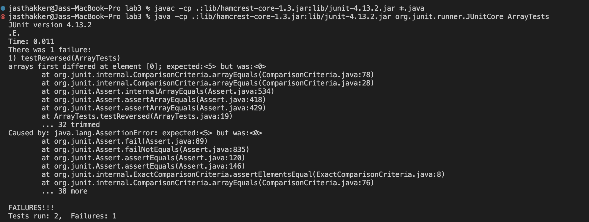

## Part 1
**Shown below is the code for the StringServer**

```
import java.io.IOException;
import java.net.URI;

class Handler implements URLHandler {
    // The one bit of state on the server: a number that will be manipulated by
    // various requests.
    String str = "";

    public String handleRequest(URI url) {
        if (url.getPath().equals("/")) {
            return String.format(str);
        }
         else {
            System.out.println("Path: " + url.getPath());
            if (url.getPath().contains("/add-message")) {
                String[] parameters = url.getQuery().split("=");
                if (parameters[0].equals("s")) {
                    str=str+parameters[1]+"\n";
                    return String.format(str);
                }
            }
            return "404 Not Found!";
        }
    }
}

class StringServer {
    public static void main(String[] args) throws IOException {
        if(args.length == 0){
            System.out.println("Missing port number! Try any number between 1024 to 49151");
            return;
        }

        int port = Integer.parseInt(args[0]);

        Server.start(port, new Handler());
    }
}
```



In the image above after the Server is started on a port 4003, a string "Hello" is added.
The void main function takes the port number 4003 from the command line argument in String args[] and starts a server on that port
The handleRequest function is called to handle the request
The URI uri variable is updated to the URL of the page that is "http://localhost:4003/add-message?s=Hello"
The parameters array stoers s=Hello and the "Hello" is added to the empty String str which is displayed.



In the image above a string "How are you" is added to the already started server on port 4003
The handleRequest function is called to handle the request
The URI uri variable is updated to the URL of the page that is "http://localhost:4003/add-message?s=How-are-you"
The parameters array stoers s=How are you and the "How are you" is added to the String str which is thus updated and then displayed.


## Part 2 
**The input below induces a failure for a buggy program**

```
 @Test
  public void testReversed() {
    int []input2={1,2,3,4,5};
    assertArrayEquals(new int[]{5,4,3,2,1}, ArrayExamples.reversed(input2));
  }
  ```
  
  
**The next code block of input below for the same sniipet of the buggy program does not induce a failure**

```
@Test
  public void testReversed2() {
    int[] input1 = { };
    assertArrayEquals(new int[]{ }, ArrayExamples.reversed(input1));
  }
  ```
  **As it can be seen one of the 2 tests fails because one input induced a failure and the other didn't**
  
  
  

**Buggy code before being fixed**
```
static int[] reversed(int[] arr) {
    int[] newArray = new int[arr.length];
    for(int i = 0; i < arr.length; i += 1) {
    arr[i]=newArray[arr.length - i - 1];
    }
    return arr;
  }
```
**The bug here is that the array is to be reversed, stored and returned in a new array which is created however the array is being updated and is beign returned in the original one itslef causing unexpected and buggy output.**

**This can be fixed as shown in the code block below**

```
static int[] reversed(int[] arr) {
    int[] newArray = new int[arr.length];
    for(int i = 0; i < arr.length; i += 1) {
    newArray[arr.length - i - 1]=arr[i];
    }
    return newArray;
  }
```


## Part 3
In week 2 I learnt about GitHub Desktop which is a great tool to clone github repositories locally on your computer so you can use them with the IDE of your choice while also taking care of version control
I also learnt about the URIHandler interface which helped me make simple webservers, althought the webservers we made were basic, I could definitely see the through the huge scope of this concept
In week 3 i learnt to set up and use Junit testing which also helps me in my CSE12 class. I also learnt what problems could cause bugs and also learnt to trouble shoot them
