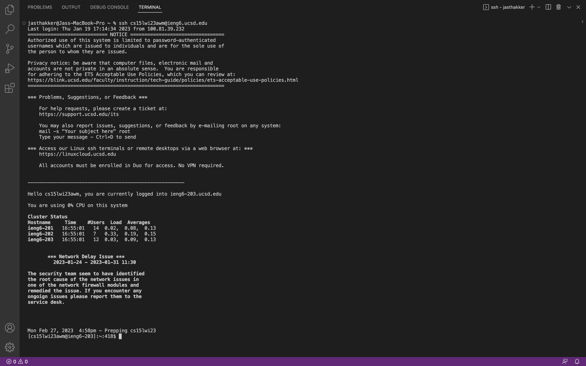
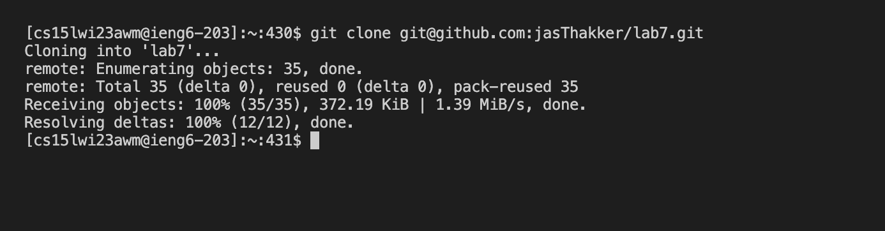
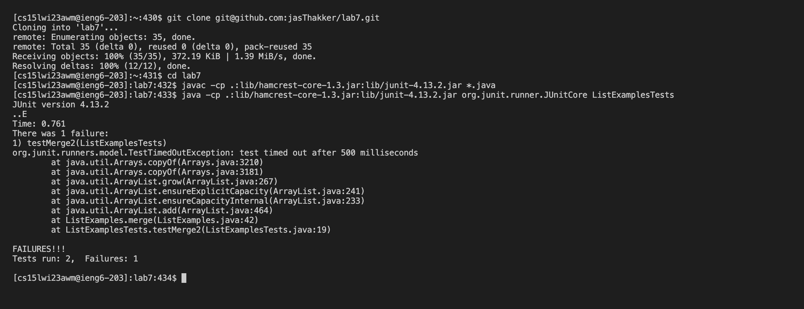

# **Lab Report 4**

## Steps followed for CLDQ competiton

## Step 4 :Logging into ieng6

I had set up the ssh key for logging into my ieng6 account so logging to my ieng6 account was fairly easy which I did by writing this piece of code
`ssh cs15lwi23awm@ieng6.ucsd.edu`

## Step 5: Cloning my fork of the repository from my GitHub account
I had set up the ssh key for my github account as well so I just copied it from github.com where I had my fork of the repository and wrote the command:
`git clone` in the terminal and then just pasted the copied github ssh key to complete the command as `git clone git@github.com:jasThakker/lab7.git`
and then pressed `<enter>` and then the cloning happened.

## Step 6: Running the tests and demonstrating that they fail
For this step I cd'd into the lab7 directory that was cloned onto my ieng6 account 

I wrote this command to change directory `cd lab7`

Running JUnit tests: Keys pressed `<up><up><up><up><up><enter>` `<up><up><up><up><up><enter>`
  

The `javac -cp .:lib/hamcrest-core-1.3.jar:lib/junit-4.13.2.jar *.java` command was 5 up in the search history, so I used up arrow to access it. 

Then the `java -cp .:lib/hamcrest-core-1.3.jar:lib/junit-4.13.2.jar org.junit.runner.JUnitCore` command was 5 up in the history, so I accessed and ran it in the same way.
 

  
##  Step 7: Editing the code to fix the failing tests
  
I typed in `nano L` `<tab>` which autocompleted the command to `nano ListExamples` and then I edited the command to `nano ListExamples.j` <tab> and this autocompleted the command to nano ListExamples.java which was the desired command to start editing the java file so I pressed `<enter>`

