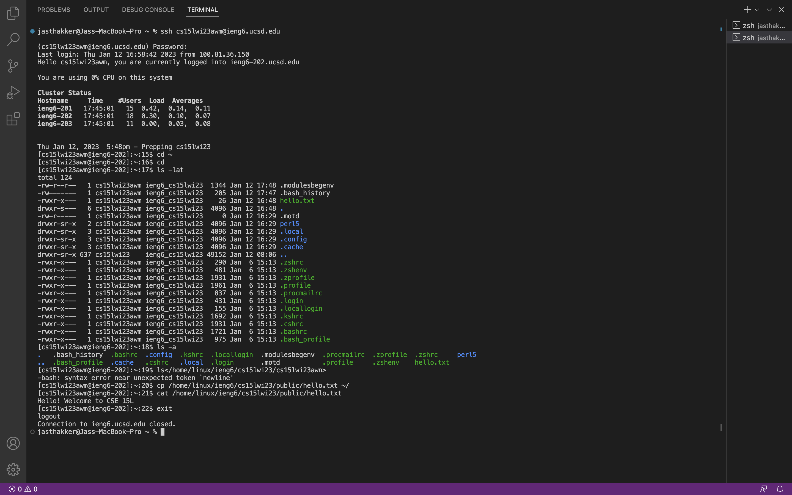
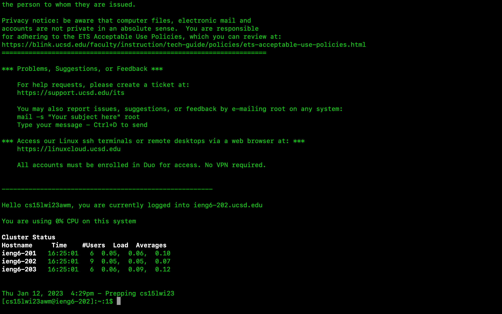

# CSE 15L Week One Lab Report - Jas Thakker
## Topics focussed on: Step by step tutorial to log into course specific content on ieng6

1.*Step 1*: **Downloading Visual Studio Code IDE**

An IDE is an integrated development environment that helps programmers develop software efficiently by making use of various great tools it has

This IDE can be downloaded from here [VS Code Download](https://code.visualstudio.com/)

After successful installation you should be able to see a window like this

2.*Step 2*: **Remotely connecting **

In this step we will learn to use the VS Code terminal to remotely connect to a computer using the Internet.

If you are using a Windows machine you first need to install git for windows from the given link [Git for Windows](https://gitforwindows.org/)

Once installed, open the VS Code terminal and type in the ssh command given below to start accessing the remote computer:

Command:**$ ssh cs15lwi23zz@ieng6.ucsd.edu**.  *Don't forget to replace the **z** with your course specific account name**

Since this could be the first time you are connecting to this server you could see a message like this:
*The authenticity of host 'ieng6.ucsd.edu (128.54.70.227)' can't be established.
RSA key fingerprint is SHA256:ksruYwhnYH+sySHnHAtLUHngrPEyZTDl/1x99wUQcec.
Are you sure you want to continue connecting (yes/no/[fingerprint])? *

**Type in yes to continue and then enter the correct password you chose to login**

Now your terminal is connected to a computer in the CSE basement making your computer the **client computer** and computer in the basement you connected to, the **server**

3.*Step 3*: **Trying out some commands!

Trying out various commands practically is the best way to get more comfortable with using the terminal

**cd** this command helps to change the directory from the current one to some other directory

**pwd** this command prints the current directory the control is in

**ls** this command prints the list of all the different files in the directory

Here are some commands to try:

* cd ~
* cd
* ls -lat
* ls -a
* cp /home/linux/ieng6/cs15lwi23/public/hello.txt ~/
* cat /home/linux/ieng6/cs15lwi23/public/hello.txt\

To exit the remote server you can type in command **exit**

