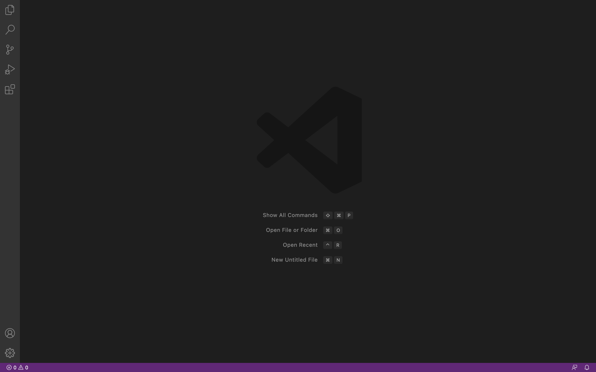

# CSE 15L Week One Lab Report - Jas Thakker
## Topics focussed on: Step by step tutorial to log into course specific content on ieng6

1.*Step 1*: **Downloading Visual Studio Code IDE**

An IDE is an integrated development environment that helps programmers develop software efficiently by making use of various great tools it has

This IDE can be downloaded from here [VS Code Download](https://code.visualstudio.com/)

After successful installation you should be able to see a window like this

